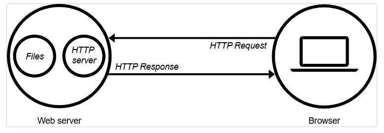

# 1. Feeling

# 2. Chức năng của một website (CRUD)

REST (REpresentational State Transfer)
API (Application Programming Interface)

## REST API
- Khái niệm: Là một API tuân theo các nguyên tắc của kiến trúc REST (Representational State Transfer).
- Nguyên tắc: REST API sử dụng các phương thức HTTP như GET, POST, PUT, DELETE để thao tác với tài nguyên.
- Tài nguyên: Tài nguyên được đại diện dưới dạng URL và có thể sử dụng các định dạng dữ liệu như JSON, XML.

## RESTful API
- Khái niệm: Là một phiên bản cụ thể hơn của REST API, thường nhấn mạnh vào việc hoàn toàn tuân thủ các nguyên tắc của REST.
- Nguyên tắc: RESTful API không chỉ sử dụng các phương thức HTTP mà còn nhấn mạnh việc sử dụng trạng thái đại diện của tài nguyên, tức là tuân theo các nguyên tắc như statelessness, cachability, và phân tầng.
- Thiết kế: RESTful thường có thiết kế rõ ràng hơn, với các URL và phương thức HTTP được định nghĩa rõ ràng để tương tác với tài nguyên.

# 3. Mô hình hoạt động

## Web server(client-server)

# 4. Vận Hành Một Website

Domain: Địa chỉ web dễ nhớ cho người dùng.
Hosting: Dịch vụ lưu trữ tệp tin trang web trên máy chủ.
Địa chỉ IP: Chuỗi số định danh thiết bị trên mạng.
## Domain(tên miền)
- Khái niệm: Là địa chỉ trực tuyến của một trang web mà người dùng sử dụng để truy cập. Ví dụ: www.example.com.

## Hosting (Lưu trữ)
- Định nghĩa: Là dịch vụ cung cấp không gian trên máy chủ để lưu trữ các tệp tin của trang web, bao gồm HTML, hình ảnh, video, và cơ sở dữ liệu.
- Chức năng: Hosting đảm bảo rằng trang web có thể truy cập được từ Internet 24/7. Các nhà cung cấp dịch vụ hosting cung cấp các gói dịch vụ khác nhau, từ lưu trữ chia sẻ cho đến máy chủ riêng (VPS) hoặc máy chủ độc lập.
- Loại hình: Có nhiều loại hosting khác nhau như:
    + Shared Hosting: Nhiều trang web chia sẻ một máy chủ.
    + VPS Hosting: Một máy chủ vật lý được phân chia thành nhiều máy chủ ảo.
    + Dedicated Hosting: Người dùng có toàn quyền truy cập vào một máy chủ riêng.

## Địa chỉ IP
- Định nghĩa: Là một chuỗi số duy nhất được gán cho mỗi thiết bị kết nối vào mạng Internet. Địa chỉ IP giúp định vị và giao tiếp giữa các thiết bị.
- Chức năng: Địa chỉ IP cho phép các máy tính và thiết bị trao đổi thông tin qua Internet. Có hai loại địa chỉ IP chính:
    + IPv4: Địa chỉ dạng số, ví dụ: 192.168.1.1.
    + IPv6: Địa chỉ dạng dài hơn, sử dụng để mở rộng không gian địa chỉ, ví dụ: 2001:0db8:85a3:0000:0000:8a2e:0370:7334.
- Chuyển đổi: Khi bạn nhập một tên miền vào trình duyệt, hệ thống DNS sẽ chuyển đổi tên miền đó thành địa chỉ IP để tìm ra máy chủ lưu trữ trang web.

# 5. Dữ Liệu Để Hiển Thị Website

## Dữ liệu tĩnh (static)

## Dữ liệu động (dynamic)

## Lưu trữ dữ liệu

# 6. Database

Database là cách chúng ta 'tổ chức và lưu trữ' dữ liệu website một cách hiệu quả.

## Với database, chúng ta lưu trữ dữ liệu với 2 cách:
- Sử dụng dữ liệu quan hệ (Relational Database - SQL) : MySQL, Postgres, Oracle, SQL Server...
- Sử dụng dữ liệu phi quan hệ (Non-Relational Database / NoSQL): MongoDB, Redis...

## SQL (Relational Database)
- Là cơ sở dữ liệu quan hệ
- Dữ liệu được lưu trữ trong các tables. Mỗi tables có nhiều rows, fields.
- Các table có 'quan hệ với nhau'

## NoSQL
- Là cơ sở dữ liệu phi quan hệ
- Dữ liệu được tổ chức dưới dạng 'documents' => object

## ORM/ODM: findUserById(1)

## raw query: 
-sql: select * from users where id = 1 
-nosql: db.collection.find({ id: 1 })

